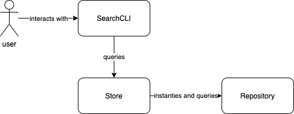

# Bloom - Search CLI 🌸

A CLI-based application to lookup details for users, organisations and support tickets

## Getting Started

### Prerequisites

- Node
  - Tested on v14.16.1 but may work with earlier versions
  - This project manages its Node version using [Nodenv](https://github.com/nodenv/nodenv) (See `.node-version` file), but Nodenv is not required to run this project
- NPM

### Development
- Clone this repo locally
- `cd` into folder and run `npm install`
- Run `npm start` to start application
- Run `npm test` to run test suite
- Run `npm run format` to format code as per [Prettier's standards](https://prettier.io/)

## Design

### Dependencies
- [readline-sync](https://www.npmjs.com/package/readline-sync) - Used to read user input.
- [Jest](https://jestjs.io/) - Testing framework
- [Prettier](https://prettier.io/) - Code formatting

### Assumptions
- When returning entities related to a particular record:
  - We are interested in seeing all fields for a related entity
  - We are only interested in loading their nearest neighbours (ie: We return tickets with their submitter, assignee and organisation. We don't then load the submitter or assignee's organisation)
- This application will only retrieve its data from a set of JSON files on startup. However, if this was to change at a later date we could implement a new loader to retrieve data stored in a different format, or add records to our repositories at runtime.

## Approach
- For the most part I used TDD, but I worked outside-in as I started by writing a repository object. This was so I could figure out how we might store and query records before hooking up a user interface.
- I was hoping to write an integration test to simulate how a user would drive the application and see results given some input but I wasn't able to figure out how to mock stdin or pipe commands into `index.js`

## Other comments
- I know the data file is named `organizations.json` but, aside from the filename and some queries that reference `organization_id`, I've spelt it as `organisations` throughout this entire submission. Force of habit, sorry.
- Why Bloom? I don't know. Naming things is hard.
